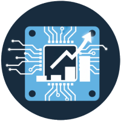

#  QuickDash

A lightweight simplified dashboard which is easy to install on many ways


## Install script
TBC

## Docker
TBC

## Build

Windows
```shell
go build -o ./dist/main.exe ./src/
```

Linux
```shell
go build -o ./dist/main ./src/
```

## Dev with Air

[Air](https://github.com/air-verse/air) is an easy way to spin up and dev on any golang applications which provides hot reloads upon file changes

```shell
go install github.com/air-verse/air@latest
air
```

## References

Motivated by
- [Appsmith dash](https://opensource.com/article/23/3/build-raspberry-pi-dashboard-appsmith)
- [Raspberry Pi Dashboard](https://github.com/femto-code/Raspberry-Pi-Dashboard/tree/release)

Templates used

- [Admin Template Day](https://github.com/tailwindtoolbox/Admin-Template-Day)
- [Admin Template Night](https://github.com/tailwindtoolbox/Admin-Template-Night)