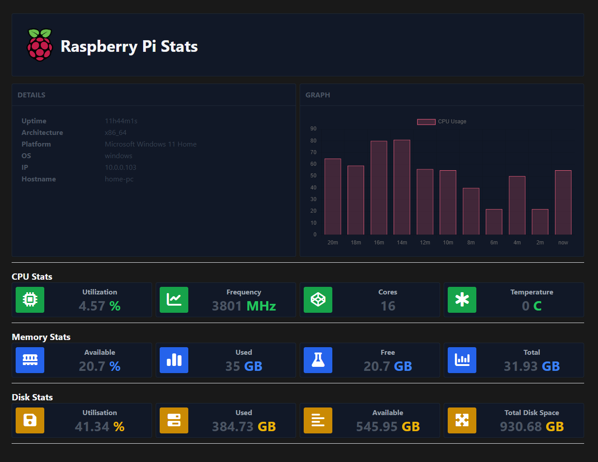

#  QuickDash

A lightweight simplified dashboard which is easy to install on many ways


## Install script
TBC

## Docker

You can build your own docker container if you wish. 
Requirements to have "docker" command available on your system

### Build

Run the following command to build your docker image

```shell
docker build -t 'quickdash' .
```


### Test

Once the build is complete, you can run the following command to test the OCI.

```shell
docker run -p 3000:3000 --rm quickdash
```

The container will open port `3000` so your website will be available on `http://localhost:3000`

## Binary

When building the binaries it will embed all the neccesary files inside.
The binaries van be found in "/dist" folder after build

### Windows
```shell
go build -o ./dist/main.exe ./src/
```

### Linux
```shell
go build -o ./dist/main ./src/
```

## Dev with Air

[Air](https://github.com/air-verse/air) is an easy way to spin up and dev on any golang applications which provides hot reloads upon file changes

```shell
go install github.com/air-verse/air@latest
air
```

## References

Motivated by
- [Appsmith dash](https://opensource.com/article/23/3/build-raspberry-pi-dashboard-appsmith)
- [Raspberry Pi Dashboard](https://github.com/femto-code/Raspberry-Pi-Dashboard/tree/release)

Templates used

- [Admin Template Day](https://github.com/tailwindtoolbox/Admin-Template-Day)
- [Admin Template Night](https://github.com/tailwindtoolbox/Admin-Template-Night)